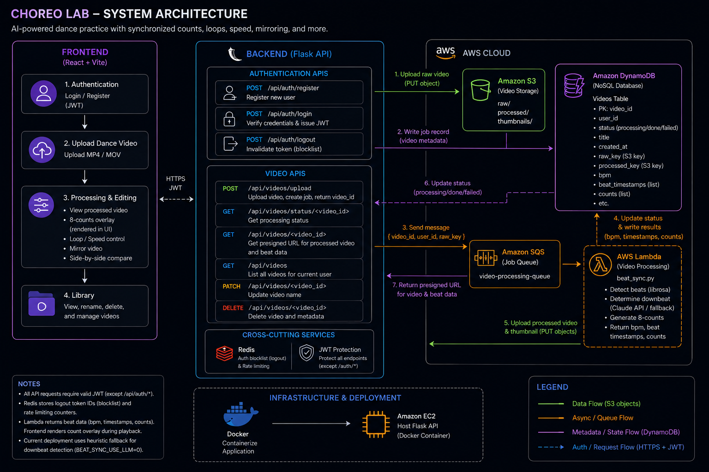

## Choreo Video Library System Architecture

#### System Diagram


#### Frontend
The frontend is built with Vite and React. After authentication, it will let the user upload any dance video file they want and then process the video in the backend. The backend will then return a processed video that will help the user learn the dance better. Features of this app include counts synchronized to the dance video, custom looping and speed, video mirroring, and comparison dances side by side.

Here is a preview of the frontend file architecture.

```
src/
├── pages/
│   ├── Auth.css
│   ├── Auth.jsx          # Authentication page (starting page for user)
│   ├── UploadDance.css
│   └── UploadDance.jsx   # Page where user uploads their dance video and views and edits their processed video
├── App.jsx
├── index.css
├── main.jsx              # App entry point
```


### Authentication
Authentication is handled by Flask, backed by a Users table in DynamoDB. It uses three APIs:
- **Register**: Creates a new entry in the DynamoDB `Users` table hashed by bcrypt
- **Login**: Verifies credentials against the `Users` table and issues a JWT token
- **Logout**: Token ID stored in Redis to track which users are logged out

API endpoints are protected and check for a valid JWT token.

### APIs
The backend is written in Python/Flask. Here are the APIs used in the backend:

| Endpoint | Method | Description |
|---|---|---|
| `/api/videos/upload` | POST | Accepts an mp4/mov file and returns a `video_id` corresponding to the uploaded video. Uploads the raw video to S3, writes a job record to DynamoDB, writes job status to Redis, and starts background processing in a thread and runs `video_processor.py`. |
| `/api/videos/status/<video_id>` | GET | Returns the current processing status (`processing`, `done`, or `failed`) from Redis. Used to poll if the video is done processing. |
| `/api/videos/<video_id>` | GET | Returns a presigned S3 URL for the processed video when a user clicks on a video in the library list view. |
| `/api/videos` | GET | Returns all videos belonging to the current user for the library list view. |

### Video Processing Flow
- User sends video file over to backend in `upload_video` POST request
- Raw video uploaded to Amazon S3, job record written to Amazon DynamoDB, and job status written to Redis
- Frontend gets video ID back and polls using `video_status` endpoint to see if that video ID is processed
- Backend starts a background thread and runs `video_processor.py`
- `video_processor.py` gets video from Amazon S3 and runs `beat_sync.py`
- `beat_sync.py` processes the video and processed video is uploaded back to Amazon S3
- DynamoDB and Redis video states are updated
- Frontend polling finally succeeds because of updated state in Redis and retrieves processed video from Amazon S3

### Model
The model handles the actual video processing. (Will add later)


### Data Storage
- Amazon DynamoDB: Database (user and video information)
- Amazon S3: Object storage (videos)
- Redis: Tracks state of video processing

### Containerization and Deployment
The app will be containerized in Docker and deployed on Amazon EC2.
